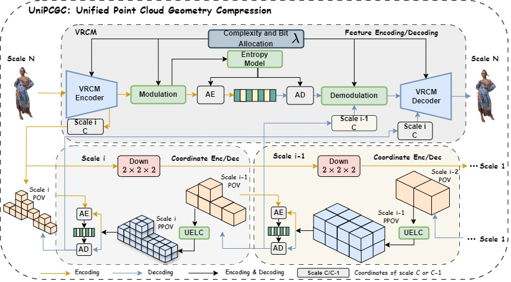

<h1 align="center">UniPCGC: Towards Practical Point Cloud Geometry Compression via an Efficient Unified Approach</h1>

<p align="center">
    <strong>Kangli Wang</strong><sup>1</sup>, <strong>Wei Gao</strong><sup>1,2*</sup><br>
    (<em>* Corresponding author</em>)
</p>

<p align="center">
    <sup>1</sup>SECE, Peking University<br>
    <sup>2</sup>Peng Cheng Laboratory, Shenzhen, China
</p>

## 📣 News
- [24-12-09] Our paper has been accepted to AAAI 2025.
- [25-03-08] We release lossless compression code.

## Todo
- [x] ~~Release training code~~ 
- [x] ~~Release inference code~~
- [x] ~~Release the Paper~~
- [ ] Release checkpoint
- [ ] Simplify the code
## 📌 Introduction

We propose an efficient unified point cloud geometry compression framework UniPCGC. It is a lightweight framework that supports lossy compression, lossless compression, variable rate and variable complexity. First, we introduce the Uneven 8-Stage Lossless Coder (UELC) in the lossless mode, which allocates more computational complexity to groups with higher coding difficulty, and merges groups with lower coding difficulty. Second, Variable Rate and Complexity Module (VRCM) is achieved in the lossy mode through joint adoption of a rate modulation module and dynamic sparse convolution. Finally, through the dynamic combination of UELC and VRCM, we achieve lossy compression, lossless compression, variable rate and complexity within a unified framework. Compared to the previous state-of-the-art method, our method achieves a compression ratio (CR) gain of 8.1\% on lossless compression, and a Bjontegaard Delta Rate (BD-Rate) gain of 14.02\% on lossy compression, while also supporting variable rate and variable complexity.

<div align="center">

<br>
Ilustration of the proposed UniPCGC framework. 
</div>

## 🔑 Setup
Type the command for general installation
```
conda env create -f environment.yml
```

For the installation of [MinkowskiEngine](https://github.com/NVIDIA/MinkowskiEngine), see the official repository.

## 🧩 Dataset Preparation
Please refer to the following links to obtain the data. We thank these great works.
| Datasets | Download Link | 
|:-----: |:-----: |
| ShapeNet | [Link](https://github.com/NJUVISION/SparsePCGC)  |
| 8iVFB | [Link](http://plenodb.jpeg.org/pc/8ilabs/)  |
| Testdata | [Baidu Netdisk](https://pan.baidu.com/s/1p3ubD5m0yGkmDMSK7pbxAQ?pwd=kkll) (kkll) |

## 🚀 Running
For lossless compression, run the following code to train
```
python train_lossless.py --dataset "your dataset dir" --lr 8e-4
```
run the following code to compress and decompress  
```
python unicoder_lossless.py --filedir "your dataset dir" --ckptdir "your ckpt dir"
```

## 🔎 Contact
If your have any comments or questions, feel free to contact [kangliwang@stu.pku.edu.cn](kangliwang@stu.pku.edu.cn).

## 👍 Acknowledgement
Thanks for their awesome works ([PCGCv2](https://github.com/NJUVISION/PCGCv2) and [MinkowskiEngine](https://github.com/NVIDIA/MinkowskiEngine)).

## 📘 Citation
Please consider citing our work as follows if it is helpful.
```bibtex
@article{Wang_Gao_2025,
title={UniPCGC: Towards Practical Point Cloud Geometry Compression via an Efficient Unified Approach},
volume={39},
url={https://ojs.aaai.org/index.php/AAAI/article/view/33387},
DOI={10.1609/aaai.v39i12.33387},
number={12},
journal={Proceedings of the AAAI Conference on Artificial Intelligence},
author={Wang, Kangli and Gao, Wei},
year={2025},
month={Apr.},
pages={12721-12729} }
```
